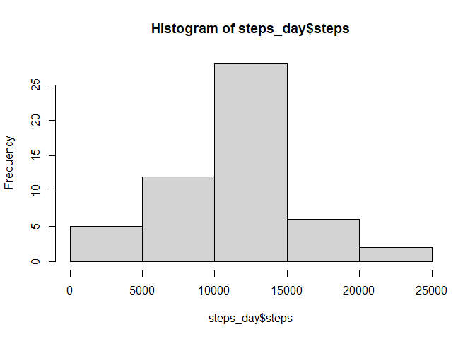

## Loading and preprocessing the data

```r
getwd()
```

```
## [1] "F:/R-Coursera/RepData_PeerAssessment1"
```

```r
activity_data<-read.csv("activity.csv")
summary(activity_data)
```

```
##      steps            date              interval     
##  Min.   :  0.00   Length:17568       Min.   :   0.0  
##  1st Qu.:  0.00   Class :character   1st Qu.: 588.8  
##  Median :  0.00   Mode  :character   Median :1177.5  
##  Mean   : 37.38                      Mean   :1177.5  
##  3rd Qu.: 12.00                      3rd Qu.:1766.2  
##  Max.   :806.00                      Max.   :2355.0  
##  NA's   :2304
```

```r
head(activity_data)
```

```
##   steps       date interval
## 1    NA 2012-10-01        0
## 2    NA 2012-10-01        5
## 3    NA 2012-10-01       10
## 4    NA 2012-10-01       15
## 5    NA 2012-10-01       20
## 6    NA 2012-10-01       25
```

```r
names(activity_data)
```

```
## [1] "steps"    "date"     "interval"
```

```r
str(activity_data)
```

```
## 'data.frame':	17568 obs. of  3 variables:
##  $ steps   : int  NA NA NA NA NA NA NA NA NA NA ...
##  $ date    : chr  "2012-10-01" "2012-10-01" "2012-10-01" "2012-10-01" ...
##  $ interval: int  0 5 10 15 20 25 30 35 40 45 ...
```

## What is mean total number of steps taken per day?
1. Calculate total number of steps taken per day and show using histogram
2. Calculate mean and median of total number of steps taken per day.
3. mean is stored in variable mean_steps_day
4. median is stored in variable median_steps_day

```r
steps_day <- aggregate(steps~date,activity_data,sum,na.rm=TRUE)
hist(steps_day$steps)
```

<!-- -->

```r
mean_steps_day<-mean(steps_day$steps)
mean_steps_day
```

```
## [1] 10766.19
```

```r
median_steps_day<-median(steps_day$steps)
median_steps_day
```

```
## [1] 10765
```

## What is the average daily activity pattern?
1.  Time series plot (i.e.type = "l") of the 5-minute interval (x-axis) and the average number of steps taken, averaged across all days (y-axis)
2. Interval with maximum number of steps

```r
steps_interval<-aggregate(steps~interval,data=activity_data,mean,na.rm=TRUE)
plot(steps~interval,data=steps_interval,type="l")
```

<!-- -->

```r
interval_max_steps<-steps_interval[which.max(steps_interval$steps),]$interval
interval_max_steps
```

```
## [1] 835
```
## Imputing missing values
1. Calculate and report the total number of missing values in the dataset (i.e. the total number of rows with 𝙽𝙰s).
The total number of missing values in the dataset is stored in the variable total_missings.
2. We’ll fill in all the missing values in the dataset with the mean per interval.


```r
total_missings<-sum(is.na(activity_data$steps))
total_missings
```

```
## [1] 2304
```

```r
mean_steps_interval<-function(interval){
  steps_interval[steps_interval$interval==interval,]$steps
}
```
3. Creating new data with no missing values.

```r
activity_no_na<-activity_data
for(i in 1:nrow(activity_no_na)){
  if(is.na(activity_no_na[i,]$steps)){
    activity_no_na[i,]$steps<-mean_steps_interval(activity_no_na[i,]$interval)

  }
}
```

4. Make a histogram of the total number of steps taken each day and Calculate and report the mean and median total number of steps taken per day. Do these values differ from the estimates from the first part of the assignment? What is the impact of imputing missing data on the estimates of the total daily number of steps?

```r
steps_day_no_na<-aggregate(steps~date,data=activity_no_na,sum)
hist(steps_day_no_na$steps)
```

<!-- -->

```r
# Mean No NA
mean_steps_no_na<-mean(steps_day_no_na$steps)
mean_steps_no_na
```

```
## [1] 10766.19
```

```r
# Median No NA
median_steps_no_na<-median(steps_day_no_na$steps)
median_steps_no_na
```

```
## [1] 10766.19
```
* After imputing missing values, mean remained same and median changed about 0.1% of the original value.

## Are there differences in activity patterns between weekdays and weekends?
1. Create a new factor variable in the dataset with two levels – “weekday” and “weekend” indicating whether a given date is a weekday or weekend day.

```r
activity_no_na$date<-as.Date(strptime(activity_no_na$date, format="%Y-%m-%d"))
activity_no_na$day<-weekdays(activity_no_na$date)
for (i in 1:nrow(activity_no_na)){
  if(activity_no_na[i,]$day %in% c("Saturday","Sunday")){
    activity_no_na[i,]$day<-"weekend"
  }
  else{
    activity_no_na[i,]$day<-"weekday"
  }
}
steps_by_day<-aggregate(activity_no_na$steps~activity_no_na$interval+activity_no_na$day,activity_no_na,mean)
```
2. Make a panel plot containing a time series plot (i.e. 𝚝𝚢𝚙𝚎 = “𝚕”) of the 5-minute interval (x-axis) and the average number of steps taken, averaged across all weekday days or weekend days (y-axis). See the README file in the GitHub repository to see an example of what this plot should look like using simulated data.

```r
names(steps_by_day) <- c("interval", "day", "steps")
library(lattice)
xyplot(steps ~ interval | day, steps_by_day, type = "l", layout = c(1, 2), 
    xlab = "Interval", ylab = "Number of steps")
```

<!-- -->
